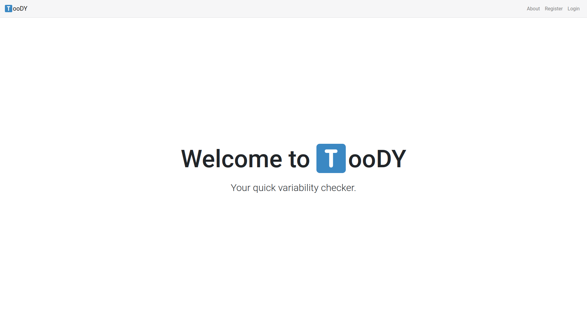
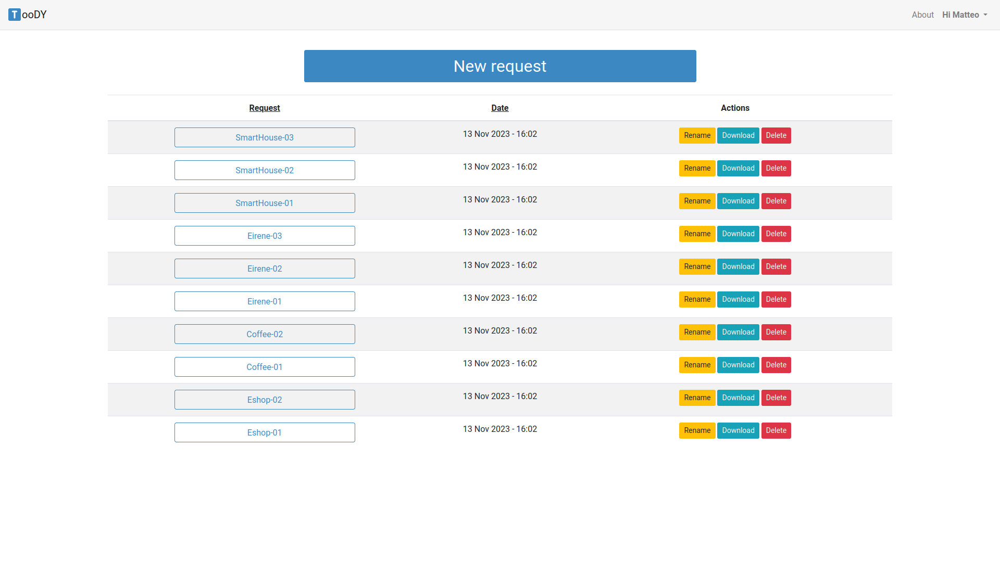

# TooDY, a new Tool for Detecting variabilitY



## Project Description
*TooDY* is a natural language processing tool designed to identify variability indicators in requirement documents. It leverages lexical and syntactic analysis and is built upon the *spaCy* library.

This tool situates itself in the research line of specifying software product lines (*SPL*) from natural language requirement documents. Ambiguities in requirement documents often lead to inconsistencies between client expectations and the developed product, resulting in undesirable rework of artifacts. However, ambiguity can also be a means to defer decisions.

Building on this concept, it has been shown that ambiguity detection can also serve as a way to capture hidden aspects of variability in requirements, utilizing specific variability indicators that differ from known ambiguity indicators.


## Dependencies and Local Deployment
In order to execute the application locally, you'll need to install the required dependencies and libraries. Clone this repository first and navigate to the project directory:
```bash
git clone https://github.com/matteogiorgi/toody
cd toody
```

### Required Libraries
The application is written in *Python* and depends on several *Python* libraries, including:
- **spaCy** for natural language processing.
- **Flask** a lightweight WYSIWYG web application framework.
- **Flask-Login** for managing user sessions.
- **Flask-SQLAlchemy** an ORM for *Flask* applications.
- **Werkzeug** for password hashing and authentication.
- **APScheduler** for scheduling background jobs.
- **python-slugify** for generating slugs from strings.
- **Pytz** for timezone calculations.

### Installing Dependencies
To install the required dependencies, first make shure you have [*Python*](https://www.python.org/downloads/) and [*pip*](https://pip.pypa.io/en/stable/getting-started/) installed. Then, run the following command:
```bash
pip install spacy flask flask_login flask_sqlalchemy werkzeug apscheduler python-slugify pytz
```

### Setting up spaCy
After installing *spaCy*, you'll need to download the language model:
```bash
python -m spacy download en_core_web_sm
```

### Running the Application Locally
To start the *Flask* server on your local machine, navigate to the project directory and run:
```bash
python app.py
```


## Additional Information



### Academic Significance
This project has been developed as the final project for the Bachelor's thesis in Computer Science at the *University of Pisa*. The thesis demonstrates the application of natural language processing techniques and delivers a tool for detecting variability indicators in requirement documents.

- **Dissertation**: for an in-depth understanding of the theoretical background and the methodologies adopted in this project, you can access the dissertation at [this link](https://github.com/matteogiorgi/toody-dissertation).
- **Live Application**: to see the web application in action, visit [matteogiorgi.pythonanywhere.com](https://matteogiorgi.pythonanywhere.com/).


## License
This project is licensed under the *GPL-3.0 license* - see the [`LICENSE`](LICENSE) file for details.
